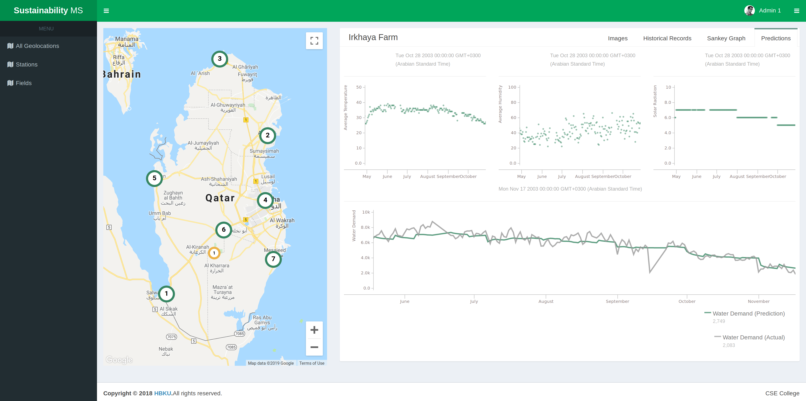

## Installation
```
export project_name={{ project_name }}
mkvirtualenv $project_name
pip install django
django-admin.py startproject --template=https://github.com/atroudi/biosensors/archive/docker-deployment.zip $project_name
cd $project_name
```
1. Follow [backend/README.md](backend/README.md)
1. Follow [frontend/README.md](frontend/README.md)

## Docker
1. Deploy production docker image
````
sudo docker-compose build
sudo docker-compose run django python3 manage.py migrate
sudo docker-compose up 
````

## Screenshot


